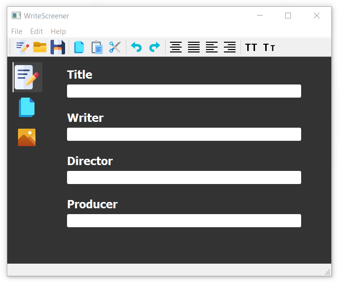

# 📝🎬 WriteScreener

 &ensp; <!---  &nbsp; -->

  &ensp;

## A propos

WriteScreener est un logiciel d'écriture de scénarios de manière collaborative.

Il permet d'écrire un scénario localement sur votre PC, et d'utiliser un cloud pour permettre la collaboration.\
Le programme étant modulaire, il sera possible d'implémenter l'utilisation de plusieurs clouds, en ajoutant des fichiers spécifiques, qui s'occuperont des requêtes faites aux APIs.\
Pour le moment deux clouds sont envisagés :
- Github
- Google Drive

___
## Compilation

Le logiciel est écrit en C++ et est basé sur Qt.

Pour l'exécuter :
- suivre ces documents : 

https://wiki.qt.io/Build_Standalone_Qt_Application_for_Windows \
https://wiki.qt.io/Deploy_an_Application_on_Windows/fr
- Le plus simple :
    - lancer QtCreator et compiler le programme
    - créer un dossier "Application" et mettre dedans :
        - L'application `WriteScreener.exe`
        - Tous les fichiers `.dll` de `Qt\5.2.1\mingw48_32\bin\`
        - Tous les répertoires de `Qt\5.2.1\mingw48_32\plugins\`
        
        Le dossier devrait être très lourd, il est possible de l'alléger en supprimant les fichiers inutiles. Pour savoir quels fichiers sont inutiles, c'est très simple : ouvrir l'application ete supprimer les fichiers jusqu'à ce que l'application plante
- Pour compiler le programme sans QtCreator :
    - Installer Qt (c'est la base)
    - Je ne sais pas 😉
